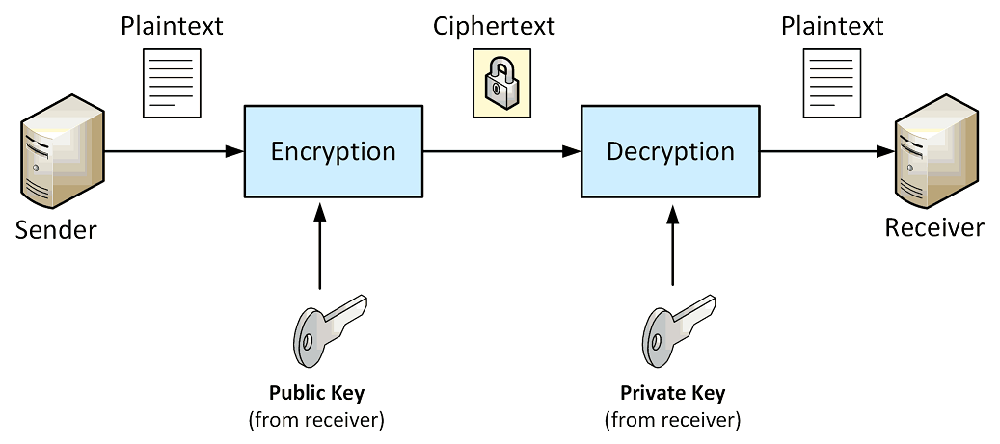

# Asymmetric Key Cryptography

The problem posed with symmetric key ciphers is how to get the secret key to the recipient so that the
recipient can decrypt the ciphertext when it is received.

Asymmetric key cryptography is one answer.
It is called asymmetric key cryptograthy because **the keys used for performing encryption and decryption are
different** and are normally reffered to as **public and private keys**.



The most popular asymmetric cipher algorithm is **RSA** which was initially publicized in 1977 by 
Ronals **R**ivest, Adi **S**hamir, and Leonard **A**dleman.

**The algoritm gets its security from the difficulty of factoring large numbers.**
Essentially, the public and private keys are functions of a pair of large primes, 
and recovering the plaintext from a given ciphertext and the public key used to create it is believed to be 
equivalent to the problem of recovering the primes used to make they keys.  

## Creating Random RSA Keys
We can use the `KeyPairGenerator` class to generate a `KeyPair`. **Key sizes should be between 2048 or 4096 bits.**

The `KeyPair` class serves as a holder for a private key and its associated public key. The `getPrivate()` and 
`getPublic()` methods return the private and public key keys.

## Optimal Asymmetric Encryption Padding 
OAEP (Optimal Asymmetric Encryption Padding) is a padding scheme used in public key cryptography. 
Padding schemes are critical in cryptography to ensure that plaintext messages are properly formatted 
to be securely encrypted and decrypted.

RSA requires padding for several important reasons:
* **Randomization**: 
    In its basic form, RSA is deterministic, meaning the same plaintext will always encrypt to the 
    same ciphertext with the same key. This predictability can be exploited in a known-plaintext attack.
    
    Padding schemes like OAEP introduce randomness into the encryption process. 
    This ensures that even if the same message is encrypted multiple times, the ciphertext is different 
    each time, thereby mitigating the risk of certain cryptographic attacks.

* **Alignment with Block Size**: RSA operates on blocks of data. Padding ensures that the data fits 
    neatly into these blocks, which is crucial for the algorithm to function correctly.

* **Data Integrity and Consistency**:
    Padding schemes often incorporate hash functions, which can be used to check the integrity of the data 
    when it is decrypted. This helps in detecting if the data has been tampered with or corrupted.

_Example_: RSA padding configuration
```Python
    padding.OAEP(
        mgf=padding.MGF1(algorithm=hashes.SHA256()),
        algorithm=hashes.SHA256(),
        label=None
    )
``` 
* `mgf=padding.MGF1(algorithm=hashes.SHA256())`: 
    * MGF1 (Mask Generation Function 1) is a component of the OAEP padding scheme.
    * It specifies how to generate a mask for the plaintext before encryption to add security.
    * The algorithm=hashes.SHA256() parameter specifies that the SHA256 hashing algorithm is 
        used in the mask generation process. SHA256 is a widely-used cryptographic hash function 
        known for its strong security properties.
* `algorithm=hashes.SHA256()`: 
    This parameter also specifies that the SHA256 hashing algorithm is used, but this time it's 
    for the OAEP padding scheme itself.
* `label=None`:
    The label parameter in OAEP can be used for additional data that should be associated with the 
    message (it's optional and not commonly used). 
    In this case, it's set to None, indicating that no label is used.

## References

* David Hook. **Beginning Cryptography with Java**. Wrox, 2005
    Chapter 4: Asymmetric Key Cryptography

* [RSA Signing and Encryption in Java](https://niels.nu/blog/2016/java-rsa.html)
  

*Egon Teiniker, 2020 - 2023, GPL v3.0* 
