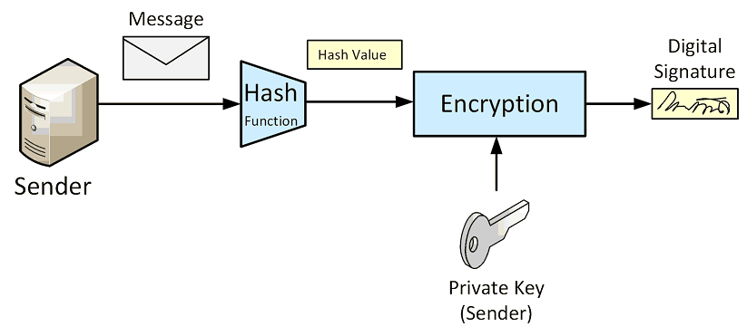
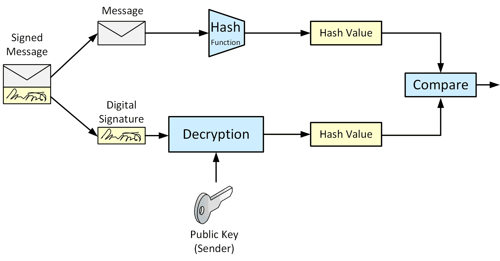

# Digital Signatures

A digital signature is created using some secret known only to the creator of a signature. 
The digital signature can be verified using public information published by the signature creator.

Digital signature algorithms are based on the use of cryptographic hashes.
**We sign a message with our private key and verify the signature with the public key.**
This allows us to make sure that a message comes from the creator of our public key (the private key holder) and that 
it wasn’t tampered with in transit.

There are two processes that are associated with digital signatures:

* **Signature construction**: We get a Signature object of type **SHA256withRSA**, initialize it with the private key, 
    updated it with all the bytes in our message and then generate a signature with the `sign()` method.
    
    

* **Signature verification**: We get a Signature instance, set it up to verify with the public key, feed it all the 
    plain text bytes and then use the signature bytes to see if the signature matches.
    This verify method returns a boolean indicating whether the signature is valid or not.

    

## Probabilistic Signature Scheme
The Probabilistic Signature Scheme (PSS) is a modern padding scheme used with 
RSA signatures to provide enhanced security.
PSS adds a probabilistic aspect to the signatures, making them more robust against certain types of cryptographic attacks. 

Here's an overview of PSS features:

* **Randomization**: PSS introduces randomness into the signature process.  
    Each time a message is signed, even if the message and the key remain the same, 
    the signature will be different. This is achieved by incorporating a random 
    salt value in the padding.

* **Salt**: A "salt" is a random string of bytes added to the message before signing. 
    The length of the salt can vary; it can be as long as the hash function output 
    or even zero. In many implementations, the salt length is chosen to be equal to 
    the output length of the hash function for maximum security.

* **Mask Generation Function (MGF)**: PSS uses a mask generation function (typically
    MGF1) to expand and distribute the randomness introduced by the salt throughout 
    the padded message. The MGF takes an input (like the hash of the message concatenated with the salt) and generates a mask of a specified length.

* **Hash Function**: A hash function (like SHA-256) is used to create a hash of 
    the original message. This hash is then combined with the salt and processed 
    through the MGF.

* **Encoding**: The PSS encoding process involves hashing the message, adding a 
    salt, generating a mask using MGF1, and then combining these components to 
    form the padded message. This padded message is then used in the RSA signing algorithm.

* **Decoding and Verification**: During verification, the signature is decoded, 
    and the original message hash is extracted. The verifier re-computes the hash 
    of the original message and compares it with the hash extracted from the signature. If they match, the signature is valid.

## References

* David Hook. **Beginning Cryptography with Java**. Wrox, 2005.
    Chapter 4: Asymmetric Key Cryptography

* [RSA Signing and Encryption in Java](https://niels.nu/blog/2016/java-rsa.html)

*Egon Teiniker, 2020 - 2021, GPL v3.0* 