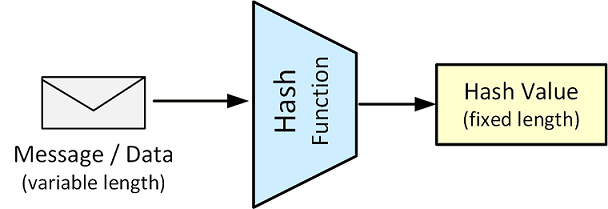

# Message Digest 

Message digests compute a **cryptographic hash**, or secure checksum, for a particular message.



Depending on the message size and the type of digest being used, the chances of generating the same message digest is extremely small.
Changing a bit in the input message for which a digest has been computed will lead to an unpredictable 
change in the bits making up the new digest if the calculation is done again.
This property of **uniqueness** and the **lack of predictability** make message digest a very useful part 
of any cryptographic toolbox.

Hash values can be used for:
* **Verify data integrity**: 
  When we download a binary file, the website hosting the download often publishes a checksum 
  on the site as well. We can generate a hash value of our downloaded file and ensure that it 
  matches the values published on the download site. If the values match, we have verified that 
  the downloaded file contains valid data.

* **Store user passwords**: 
  Security best practice state that user passwords should only be known by the user himself. 
  This can be accomplished by storing the hash value of the user’s password instead of the 
  password itself.


## Secure Hashes and Message Digests
The `hashlib` module implements a common interface to many different secure hash and message digest algorithms. Included are the FIPS secure hash algorithms SHA1, SHA224, SHA256, SHA384, and SHA512 (defined in FIPS 180-2) as well as RSA’s MD5 algorithm (defined in internet RFC 1321).

The terms “secure hash” and “message digest” are interchangeable.

_Example_: Calculate SHA256 Message Digest
```Python
    def test_SHA256(self):
        b = bytes("message", 'utf-8')
        digest = hashlib.sha256()
        digest.update(b)
        value = digest.hexdigest()
        print(value)
```

Constructors for hash algorithms that are always present in this module are `sha1()`, `sha224()`, `sha256()`, `sha384()`, `sha512()`, `blake2b()`, and `blake2s()`. 

* `hash.update(data)`: Update the hash object with the bytes-like object. 
   Repeated calls are equivalent to a single call with the concatenation of all the arguments: `m.update(a)`; `m.update(b)` is equivalent to `m.update(a+b)`.

* `hash.digest()`: Return the digest of the data passed to the `update()` method so far. 
    This is a bytes object of size `digest_size` which may contain bytes in the whole range from 0 to 255.

* `hash.hexdigest()`: Like `digest()` except the digest is returned as a string object of double length, containing only hexadecimal digits. This may be used to exchange the value safely in email or other non-binary environments.


## OpenSSL: Generate a message digest of a file
The digest functions output the message digest of a supplied file or files in hexadecimal.

To see the list of supported algorithms, use the `list --digest-commands` command.
```
$ openssl list -digest-commands
blake2b512        blake2s256        gost              md4               
md5               rmd160            sha1              sha224            
sha256            sha3-224          sha3-256          sha3-384          
sha3-512          sha384            sha512            sha512-224        
sha512-256        shake128          shake256          sm3   
```

```
$ openssl dgst -sha256 wordlist.txt 
SHA256(wordlist.txt)= fd17b0ff31d7fb7b4e202b0cd99e1f11aa1f4972aab81010544a4e562f42bac7
```

## Referecnes

* [hashlib — Secure hashes and message digests](https://docs.python.org/3/library/hashlib.html) 

* [YouTube (Christof Paar): Hash Functions](https://youtu.be/tLkHk__-M6Q)

* David Hook. **Beginning Cryptography with Java**. Wrox, 2005
    * Chapter 3: Message Digest; MACs, and HMACs

* [openssl](https://www.openssl.org/docs/man1.1.1/man1/openssl.html)

*Egon Teiniker, 2016 - 2022, GPL v3.0* 