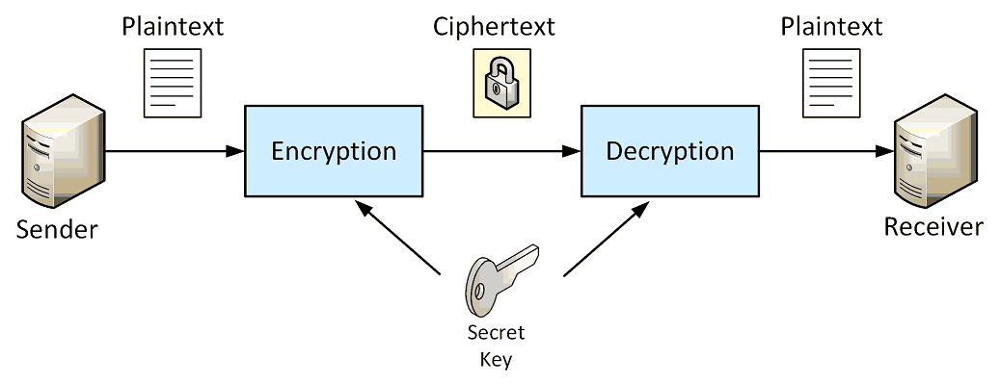

# Symmetric Encryption

A **symmetric cipher** is an algorithm that transforms **plaintext** into **ciphertext** through use of a **secret key**.
Plaintext is a message in its native form - we can simply read it. 
Ciphertext is the result of the encryption operation and appears as a sequence of bytes.
**The secret key is the critical piece in the system**. If the secret key is compromised, then so is the message hidden 
in the ciphertext.

The secret key used to generate the ciphertext is the same secret key used to decipher and return the original plaintext.
The **sender and receiver both use the same secret key**.

Symmetric ciphers are **fast** and capable of performing encryption operations even when the input data is very large.
Some symmetric cipher algorithms lend themselves to parallel encryption operations that can take full advantage 
of multiple CPUs.

Symmetric-key encryption can use either stream ciphers or block ciphers:
* **Block ciphers** take a number of bits and encrypt them as a single unit, padding the plaintext so that it is a multiple 
  of the block size. The [Advanced Encryption Standard (AES)](https://en.wikipedia.org/wiki/Advanced_Encryption_Standard) 
  algorithm uses 128-bit blocks.
* **Stream ciphers** encrypt the digits (typically bytes) of a message one at a time. An example is ChaCha20.

## Symmetric Block Cipher Padding
Most of the popular block ciphers have a block size that is more than 1 byte long: 
* **DES** and Blowfish have a block size of **8 bytes**
* **AES** has a block size of **16 bytes**

The effect of this is that the input data to a cipher that is being 
used in a blocking mode must be aligned to the block size of that 
cipher. The easiest way to deal with this issue is to use padding
mechanisms.

The **Public-Key Cryptography Standards (PKCS#5 and PKCS#7)** were
developed by RSA Security.
If we need to pad a block of data where the last input block is 3
bytes shorter than the block size of the cipher we are using, we add
3 bytes of value 3 to the data before encrypting it.
When the data is decrypted, we check the last byte of the last decrypted 
block of data and remove that many bytes from it.

The advantage of this approach is that the mechanism is unambiguous. 

## Symmetric Block Cipher Modes

### Electronic Code Book (ECB) - Don't Use It!!
ECB mode describes the use of a symmetric cipher in its rawest form. 
The problem with ECB mode is that if there are patterns
in the data, there will be patterns in the encrypted data as well.

Given a particular block of bytes on input, the cipher performs a
set of deterministic calculations, looking up a virtual code book
and returns a particular block of bytes as output. So given the same
block of input bytes, you will always get the same block of output 
bytes.

### Cipher Block Chaining (CBC)
CBC mode reduces the likelihood of patterns appearing in the cipher text 
by XOR-ing the block of data to be encrypted with the last block of 
cipher text produced and then applying the raw cipher to produce the next 
block of cipher text. 

The `IvParameterSpec` object is used to carry the i**nitialization vector (IV)**
It is the IV that provides the initial block of cipher text that is 
XOR-ed with the first block of input.

Forgetting to set the IV (or setting it to the wrong value) is a very 
common programming error. The indicator for this error is that the first 
block of the message will decrypt to garbage, but the rest of the message 
will appear to decrypt correctly.

We can also use a random IV created by a `SecureRandom` object's nextBytes()
method.

### Segment Integer Counter (CTR)
CTR or Counter mode is defined in **RFC3686**.
We don't have to specify any padding because the mode allows you to work
with any length of data (like streaming cipher).

Advantages of the CTR mode:
* It is a **streaming mode**, so we don't have to worry about padding.
* It allows for **random access** to the encrypted data.

### Galois/Counter Mode (GCM) 
Using GCM blocks are numbered sequentially, and then this block number is combined with an 
initialization vector (IV) and encrypted with a block cipher.
The result of this encryption is then XORed with the plaintext to produce the ciphertext. 

Advantages of the GCM mode:
* Like all counter modes, this is essentially a **stream cipher**, and so it is essential that a different IV is used for 
each stream that is encrypted.
* GCM can take full advantage of **parallel processing** and implementing GCM can make efficient use of an instruction 
pipeline or a hardware pipeline.
* It allows for **random access** to the encrypted data.

        
        
## References
* [cryptography: Symmetric encryption](https://cryptography.io/en/latest/hazmat/primitives/symmetric-encryption)

* [Symmetric-Key Algorithm](https://en.wikipedia.org/wiki/Symmetric-key_algorithm)

* [Block Cipher Mode of Operation](https://en.wikipedia.org/wiki/Block_cipher_mode_of_operation)

*Egon Teiniker, 2020 - 2021, GPL v3.0* 