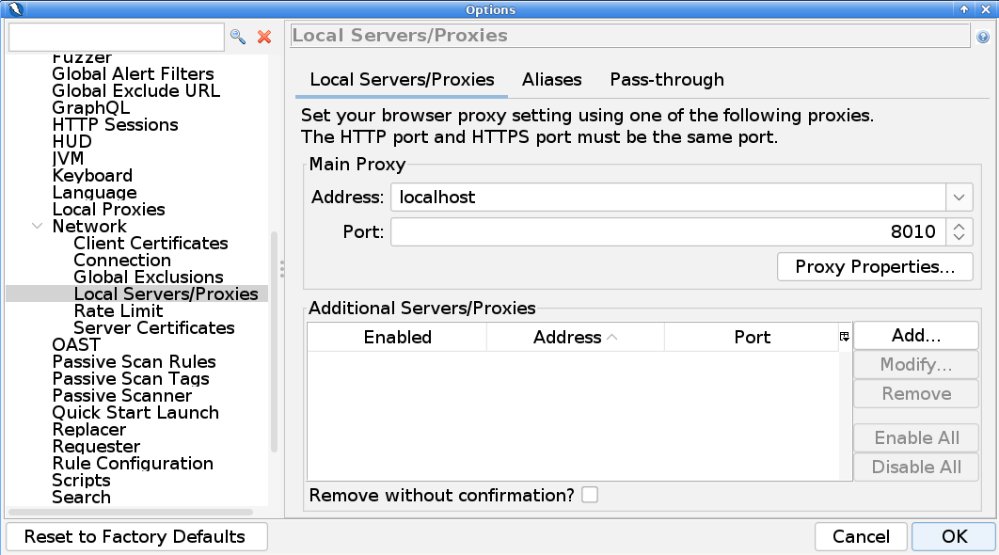
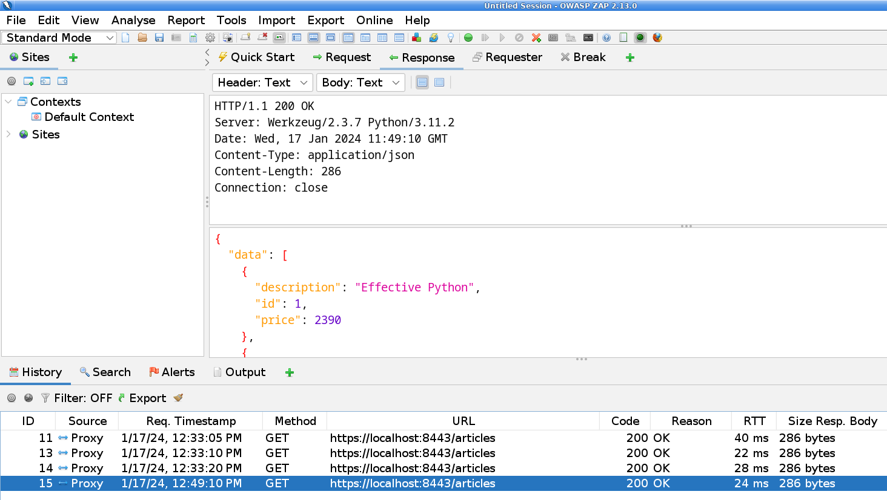
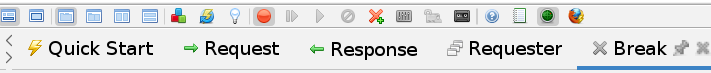

# Interception Proxy for REST APIs

In order to be able to analyze the REST requests, we can use an interception proxy, such as ZAP.

## Setup 

[ZAP](../tools/ZAP/) is already installed in the VM and we can start this interception proxy with the 
following command:
```
$ cd /opt/ZAP_2.13.0/
$ ./zap.sh
```

The interception proxy itself is also a web server that listens on port 8080. 

In local cases, this often leads to conflicts with running REST services. 
We therefore need to **change the port number of the proxy**.

Go to: **Tools/Options/Network/Local Servers/Proxies** 



In the example shown, the proxy port number is changed to the value 8010.

To try out the proxy we go to the directory: 
`api-security/http-protocol/flask-article-service-tls`

There we start the service:
```
$ python3 article_service.py

* Serving Flask app 'article_service'
 * Debug mode: on
WARNING: This is a development server. Do not use it in a production deployment. Use a production WSGI server instead.
 * Running on https://127.0.0.1:8443
Press CTRL+C to quit
 * Restarting with stat
 * Debugger is active!
 * Debugger PIN: 139-995-681
```


## Recording Requests

When we send requests to the REST API with curl, we can use the `--proxy` 
parameter to specify that the request is routed via the interception proxy.

```
$ curl -ik --proxy http://localhost:8010 https://localhost:8443/articles

HTTP/1.1 200 OK
Server: Werkzeug/2.3.7 Python/3.11.2
Date: Wed, 17 Jan 2024 11:49:10 GMT
Content-Type: application/json
Content-Length: 286
Connection: close

{
  "data": [
    {
      "description": "Effective Python",
      "id": 1,
      "price": 2390
    },
    {
      "description": "Effective Python",
      "id": 2,
      "price": 2390
    },
    {
      "description": "Effective Python",
      "id": 3,
      "price": 2390
    }
  ]
}
```

The sent request and the response from the REST API appear in the ZAP history 
and can be analyzed in the Request and Response tabs.




## Intercept Requests 

With the help of the interception proxy, requests and responses can also be manipulated.



If you click on the green **breakpoint** it turns red and the interception proxy stops the 
request. The paused request can be changed and forwarded using the **play button**.


## References
* [OWASP Zed Attack Proxy (ZAP)](https://www.zaproxy.org/)
* [Download ZAP](https://www.zaproxy.org/download/)

*Egon Teiniker, 2020-2024, GPL v3.0*