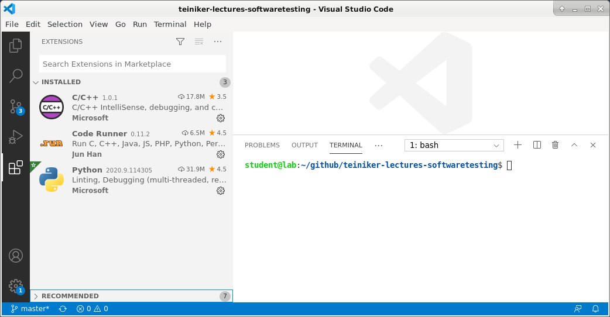

# Visual Studio Code for Python

Visual Studio Code is a **source code editor** with support for development operations like debugging, 
task running, and version control. 
It aims to provide just the tools a developer needs for a quick code-build-debug cycle.

 
## Setup VS Code for Python



* Install the **Python Extension** from Microsoft (**ms-python.python**) including 
  the **pylint** package.
* Select your **Python interpreter** by clicking on the VS Code **status bar**: `/bin/python3`
* Configure the **debugger** through the **Debug Activity Bar**: create a `launch.json` file: 
 ```      
{
    "version": "0.2.0",
    "configurations": [
        {
            "name": "Python: Current File",
            "type": "python",
            "request": "launch",
            "program": "${file}",
            "console": "integratedTerminal",
            "cwd": "${fileDirname}"
        }
    ]
}	
```       

To set the right **Python version** (python3) for the **Code Runner** as well, we have to add a
`settings.json` file to the `.vscode` directory:
```   
{
    "python.pythonPath": "python3",
    "python.terminal.executeInFileDir" : true,
    "code-runner.executorMap": {
        "python": "python3 -u",
    },
    "code-runner.fileDirectoryAsCwd": true
}
```   

_Tip_: You can find both JSON files in this documentation directory.

## References
* [Visual Studio Code](https://code.visualstudio.com/)

*Egon Teiniker, 2020-2022, GPL v3.0*
